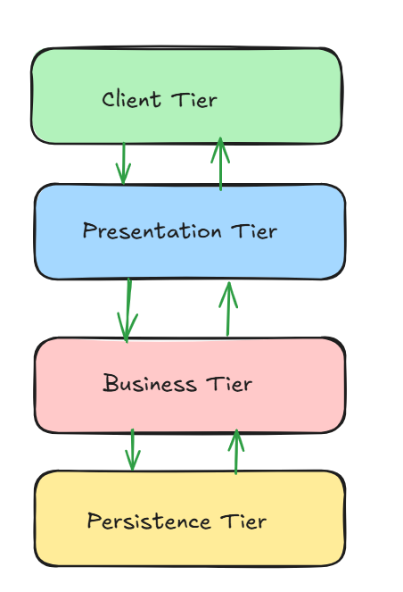
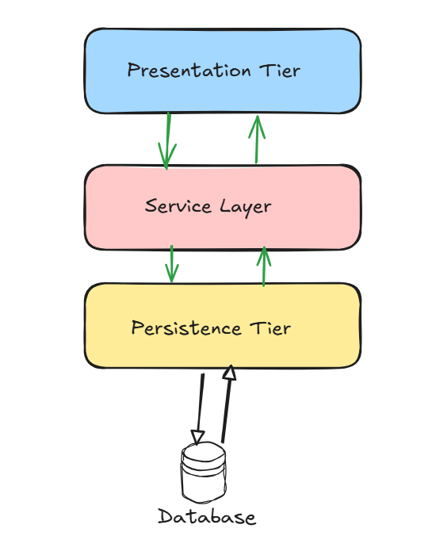

# GORM-ORM-library-for-golang

## 1. Enterprise Application

## 2. Getting started with GORM

## 3. CRUD Operations using GORM

## 4. Querying using functions

## 5. pagination

## 6. Working with relationships

## 7. Transaction Management

## 8. Enterprise Application - Implementation

For Real-time Implementation of it go to Project-capstone folder

## 1. Enterprise Applications 

 - Due to the huge amount of data involved, developing an application like social media website would have to follow a few checkpoints,
    - It should be large-scale
    - It should be integrable with new functionalities after development
    - It should be secure
    - It should be properly structured and abstracted

All the above can be achieved by developing an enterprise application

- An **Enterprise application** is a software application that helps enterprises managing their business related activities. 

- Since, the enterprise price applications are used for processing and manipulation of large amount of data, it is generally huge and complex. To Overcome this challenge of maintaining of these kind of applications are divided into different tiers like client tier, presentation tier, business tier & persistence tier



- **client Tier**: provides an interface between the end user and the application
- **Presentation Tier**: Handles User requests and displays the information to the user
- **Business Tier**: Handles the business rules of the application
- **Persistence Tier**: Acts as an interface between the business tier and the database. 

- The persistence layer interacts with relational database and the service layer. it gets data from the service layer, performs operations on a database and sends back results to the service layer. The code to interact with database is implemented in this layer.

- let's learn to develop persistence layer of an enterprise application using GORM. 

- Note that we are using postgresql database.



**Object Relational mapping (ORM)** :
- Object relational mapping (ORM) is a technique or design pattern, which maps an object model with the relational model. It has the following features :

- It resolves object-relational impedence mismatch by mapping 
    >> structs to tables in the database
    >> struct fields to columns of a table
    >> struct instance variables to rows in the table
- It helps the developer to get rid of sql queries so that they can concentrate on the business logic which leads to faster development of application.
_ It is database independent. Most of the database vendors provide support for ORM. Hence, application becomes portable without worrying about the underlying database.

ORM in Golang :
    - There are numerous GO ORMs that are being supported by golang some of them are :
```
1. XORM : A simple and powerful ORM framework for GO that supports MYSQL, POSTGRESQL, sqLITE3 and oracle
2. GO-PG : This is postgresql client and ORM for golang
3. GORM: This is an eccentric ORM library for golang. It supports MYSQL, PostgreSQL, sqlite3
```

- `GO ORM` is a developer friendly ORM for golang. This was created by Jinzhu Zhang in the year 2013. Go ORM supports native plugin and different association relationships such as one-to-one , one-to-many, many-to-many etc

- Let's learn more about this  `go orm` by building infytel application

- Infytel contains multiple modules. One of the modules of the application is the customer module which has the following functionalities :
```
Add customer
Edit customer details
View all customers
Delete customers
```

- **Data Persistence** means an application will store and retrieve information from the non-volatile storage like database.

- To install gorm `go get -u gorm.io/gorm`

- To install postgres driver for gorm `go get -u gorm.io/driver/postgres`

**opening database connection **

- First we need to define the  `Data source name (DSN) configuration ` which is string containing the necessary functions required for connection to the database. These details are :
- Host
- Database Credentials (username and password)
- Database Name
- Port
- SSL Mode

- We can store the DSN configuration details in string variable for ease of access.

```
dsn := "host=localhost user=postgres password=postgres dbname=postgres port=5432 sslmode=disable"
```

- Now let's start with importing gorm libraries :
```
"gorm.io/driver/postgres"
"gorm.io/gorm"
```

- Now to connect our application with database we can make use of gorm.Open() function. This function takes two input parameters :
    Open() : function of database driver you want to work with since, we are using postgresql for database we are using postgres.Open(). this function will take the DSN configuration string as parameter

    Address of gorm.Config() which will give us several access to configure our GORM application. Some of them are :
        - Logger Configuration: we can configure our default logger, or you can use your personal logger
        - FullsaveAssociation: we can set this value to TRUE if we are working on multiple tables
```go
//opening connection to postgresql database
Db, err = gorm.Open(postgres.Open(dsn),&gorm.Config{})
if err != nil {
    panic(err.Error())
} else {
    fmt.Println("Connection established with database")
}
```

Here, gorm.Open() function returns two values: 

Database Connection instance “Db” which is a pointer of type gorm.DB, and 
An error value which will be “nil” if the connection is successful. The error can be not nil if any of the detail in the DSN configuration string is wrong. In the above code a panic is thrown if the error is not nil.
If connection is successful with the database, then the success message in the else block will get printed in console.
With the help of ‘Db’ variable of type *gorm.DB , you can perform all kind of database operation such as create, read, update, and delete etc.


### closing database connection

- for closing the connection to database, we can use Close() function. To invoke this function :
- we need to invoke DB() function using the Database Connection instance, which is a method of gorm.DB struct. This function returns *sql.DB which is a pointer to Database and an error value (if any)
- Next we can invoke Close() function which needs the above *sql.DB as a receiver
- if connection gets closed successfully, then success message will get printed otherwise the application will get panic and throw the error.

```go

//closing connection to postgreSQL database
database, _ := Db.DB()
err := database.Close()
if err !nil {
    panic(err.Error())
} else {
    fmt.Println("connection closed successfully")
}
```

#### what is the best approach for using Open() and Close() function in a GORM application ?
- Avoid Opening and Closing the database connection for every database operation
- Always Open the database connection at the very beginning of your application execution.
    >> The approach of pre-establishing database connections before database operation is called as **Connection Pooling** and it is supported by most of the database providers

    >> Keeping the database connection open for the entire time, we can **execute and manage all database operations as transactions** and transaction management is essential as it helps us to ensure consistency and data integrity.

- Always check the database connectivity after opening the connection to database


- Avoid closing the database connection at the end of your application execution
    >> GORM internally supports connection pooling and Transaction management, and it automatically handles the opening and closing of database connections as per requirement. Hence, it is not required and avoided to manually close the connection when using GORM.

    
